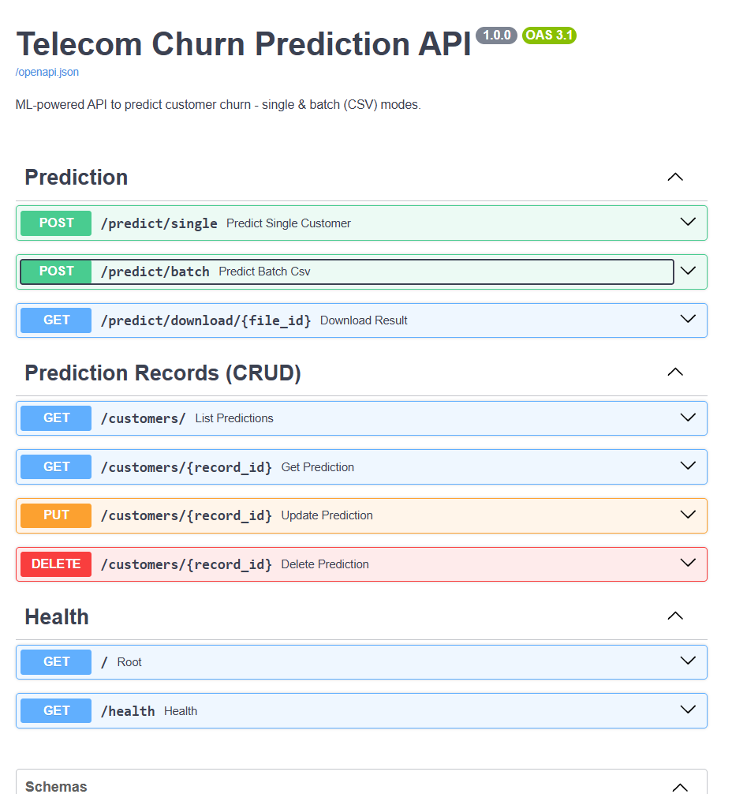
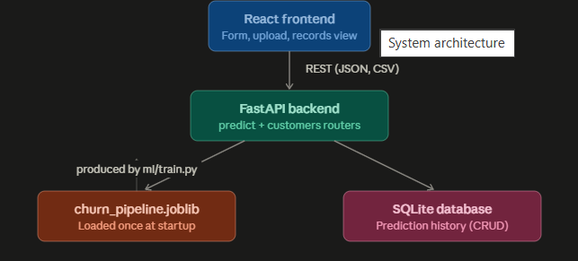
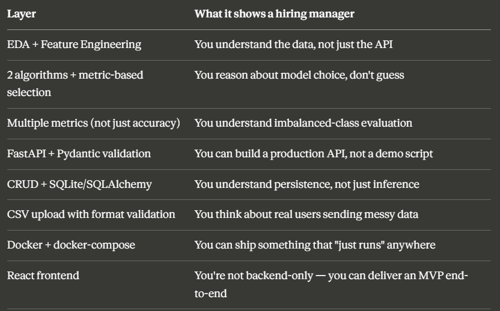
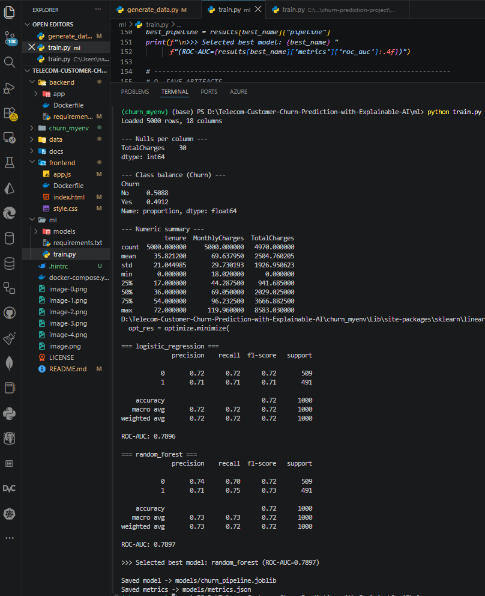
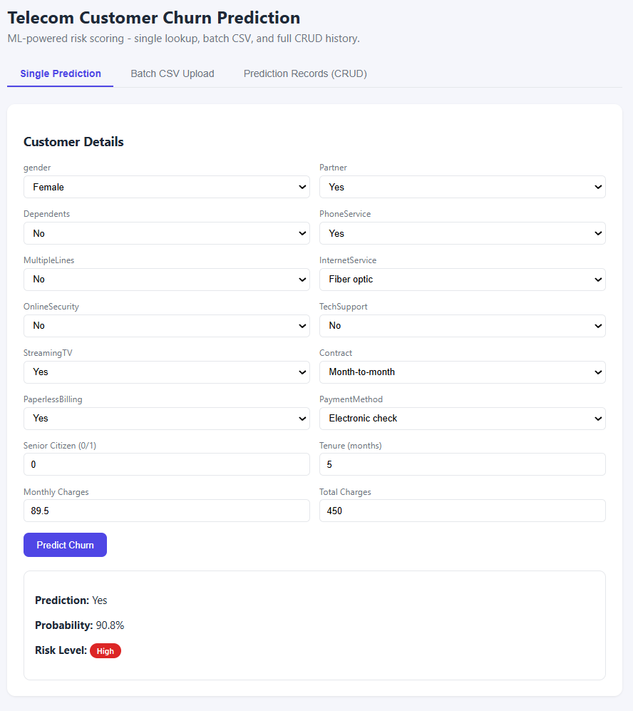
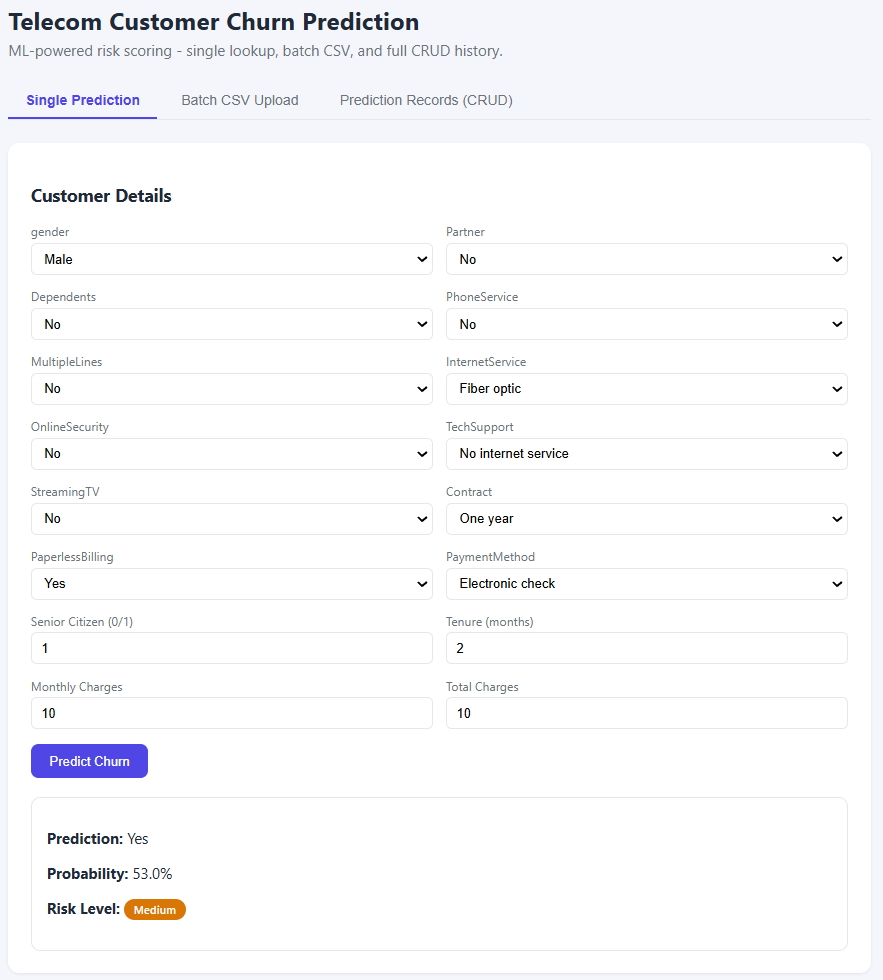
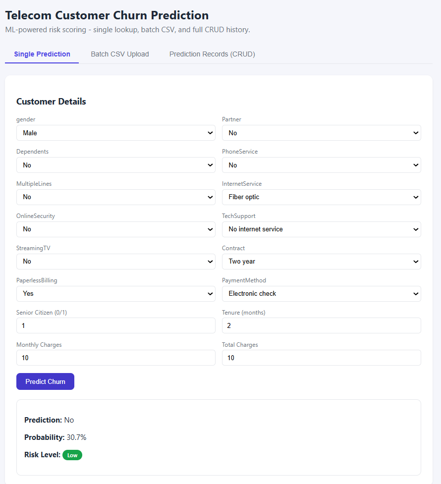

# Telecom-Customer-Churn-Prediction-with-Explainable-AI
[HTML,CSS,JS,React] 💻💻 [Python,FastAPI,Docker] 💻💻 [ML, Model, EDA, CSV, AWS] 💻💻 AI-ML Application

### --------------------------------------------------------------------------------------------------------
``
## **RUN**

Inside the Backend

### 1
`
uvicorn app.main:app --reload
`

#### 2.
`
uvicorn app.main:app --reload
`

``

``

``

``

``

``

``

`
uvicorn app.main:app --reload --port 8000
`

### --------------------------------------------------------------------------------------------------------

### --------------------------------------------------------------------------------------------------------

### --------------------------------------------------------------------------------------------------------

### --------------------------------------------------------------------------------------------------------

### --------------------------------------------------------------------------------------------------------

### Project: Telecom Customer Churn Prediction — full stack, tested end to end.

I built like;-->  Trained the model --> API --> Endpoint

**ML (ml/train.py):** EDA --> feature engineering (tenure buckets, spend ratio, addon count) --> trains Logistic Regression vs Random Forest --> picks the winner by ROC-AUC (Random Forest won, 0.79 AUC) --> saves one pipeline artifact

**FastAPI (backend/):** Pydantic-validated /predict/single, CSV /predict/batch (validates schema, returns predictions CSV), full CRUD (/customers/) over SQLite prediction history

**Docker:** Dockerfile for backend + frontend, docker-compose.yml to **run both with one command**

**Frontend:** React (CDN-based, zero build step) — single-prediction form, CSV upload, records table with delete

### --------------------------------------------------------------------------------------------------------

### --------------------------------------------------------------------------------------------------------

### --------------------------------------------------------------------------------------------------------

`
python -m venv churn_myenv
`

### --------------------------------------------------------------------------------------------------------

#### 1. Generate the dataset
`
cd data
pip install -r ../ml/requirements.txt
python generate_data.py
`
#### 2. Train the model
`
cd ../ml
python train.py
`
#### -> saves ml/models/churn_pipeline.joblib + metrics.json

#### 3. Run the API
`
cd ../backend
pip install -r requirements.txt
uvicorn app.main:app --reload --port 8000
`
#### Swagger docs: http://localhost:8000/docs

#### 4. Run the frontend (separate terminal)
`
cd ../frontend
python -m http.server 3000
`
#### Open: http://localhost:3000
`
2. Run with Docker Compose (recommended for demos)
bash
docker compose up --build
`
#### Backend:  http://localhost:8000/docs
#### Frontend: http://localhost:3000

### --------------------------------------------------------------------------------------------------------

### --------------------------------------------------------------------------------------------------------

**1. Interview talking point:**  I used synthetic data because it let me control ground truth and explain every column, but the schema and code work identically on the real Kaggle Telco dataset — I designed it to be a drop-in replacement.

**ml/train.py**

**1.Load** → pd.read_csv

**2.EDA** → null counts, class balance, numeric summary (printed as a lightweight "report" — in a real job you'd also do this in a notebook with plots, but the pipeline itself must be script-based for reproducibility)

**3.Cleaning** → coerce TotalCharges to numeric (it has blanks in the real dataset too — this is a famous real-world gotcha), drop the ID column

**4.Feature Engineering** → tenure_bucket (binned), avg_monthly_spend (derived ratio), is_new_customer (flag), num_addon_services (count)
Preprocessing pipeline → ColumnTransformer with SimpleImputer + StandardScaler for numeric columns and SimpleImputer + OneHotEncoder for categorical columns — bundled into one sklearn Pipeline so the exact same transform is applied at inference time with zero manual re-coding

**Train/test split** → stratified (important: keeps class ratio equal in train/test since churn is a classification target)

Two algorithms:
**i.LogisticRegression** (baseline — linear, interpretable, fast, class_weight="balanced" to not ignore the minority class)

**ii.RandomForestClassifier** (non-linear, captures feature interactions, usually stronger on tabular data)

**5.Metrics** — accuracy, precision, recall, F1, ROC-AUC, confusion matrix. Why not just accuracy? For churn, missing a churner (false negative) is expensive (lost revenue) — recall matters. ROC-AUC is used for model selection because it's threshold-independent and robust when classes are roughly balanced-but-not-identical.

**6.Model selection** → picks whichever model has the higher ROC-AUC automatically (max(results, key=...)) — not a hardcoded choice.

**7.Save** → one joblib file containing the entire pipeline (preprocessing + model) + the feature column order + which model won. FastAPI only ever loads one artifact.

### --------------------------------------------------------------------------------------------------------

### --------------------------------------------------------------------------------------------------------

### --------------------------------------------------------------------------------------------------------

### --------------------------------------------------------------------------------------------------------

### --------------------------------------------------------------------------------------------------------