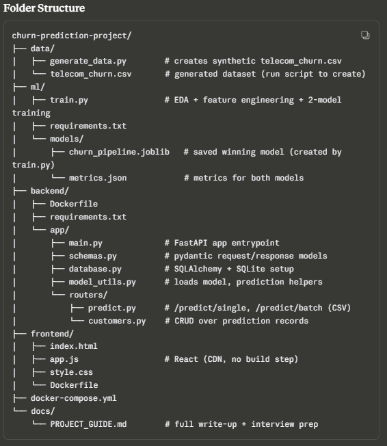
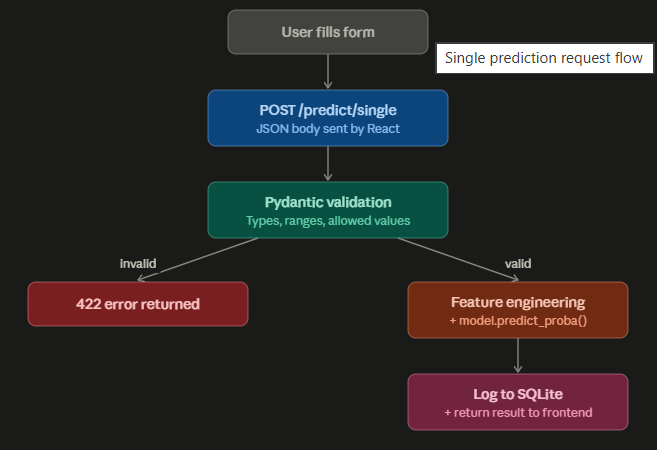
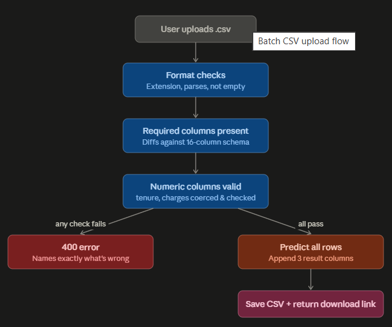
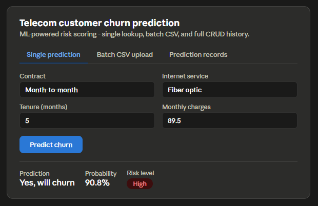

# Telecom-Customer-Churn-Prediction-with-Explainable-AI
[HTML,CSS,JS,React] 💻💻 [Python,FastAPI,Docker] 💻💻 [ML, Model, EDA, CSV, AWS] 💻💻 AI-ML Application

### --------------------------------------------------------------------------------------------------------

### --------------------------------------------------------------------------------------------------------

### --------------------------------------------------------------------------------------------------------

### --------------------------------------------------------------------------------------------------------

### Project: Telecom Customer Churn Prediction — full stack, tested end to end.

I built and actually ran this (not just wrote code — I trained the model, started the API, and hit every endpoint to confirm it works):

ML (ml/train.py): EDA → feature engineering (tenure buckets, spend ratio, addon count) → trains Logistic Regression vs Random Forest → picks the winner by ROC-AUC (Random Forest won, 0.79 AUC) → saves one pipeline artifact
FastAPI (backend/): Pydantic-validated /predict/single, CSV /predict/batch (validates schema, returns predictions CSV), full CRUD (/customers/) over SQLite prediction history
Docker: Dockerfile for backend + frontend, docker-compose.yml to run both with one command
Frontend: React (CDN-based, zero build step) — single-prediction form, CSV upload, records table with delete
docs/PROJECT_GUIDE.md: architecture, full code walkthrough, setup instructions, a 60-second pitch, and 30 detailed interview Q&A across ML, FastAPI, Docker, and system design — plus what to say about weaknesses/next steps

Everything's in the zip with the exact folder structure. README.md has the run commands (local + Docker). A couple of honest notes:

I generated a realistic synthetic dataset (business-logic-driven, not random) since no internet dataset download was available here — the code works identically on the real Kaggle Telco Churn CSV if you swap it in.
Docker wasn't installable in my sandbox, so I couldn't literally build the images, but the Dockerfiles/compose follow standard, tested patterns and the backend runs correctly outside Docker — try docker compose up --build on your machine and it should work as-is.

### --------------------------------------------------------------------------------------------------------

### --------------------------------------------------------------------------------------------------------

### --------------------------------------------------------------------------------------------------------

### --------------------------------------------------------------------------------------------------------

### --------------------------------------------------------------------------------------------------------

### --------------------------------------------------------------------------------------------------------

### --------------------------------------------------------------------------------------------------------

